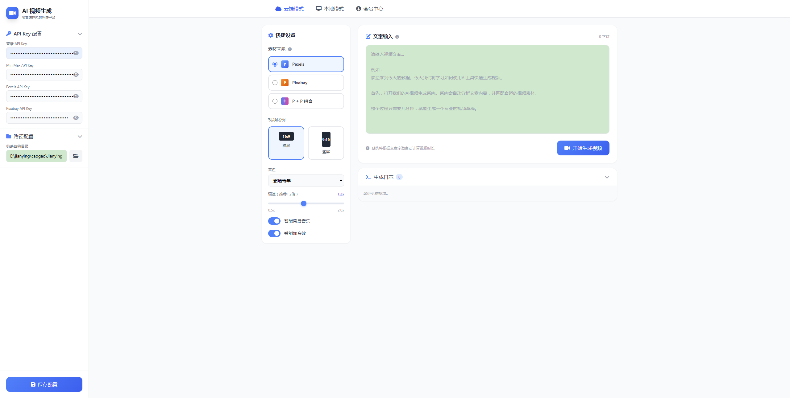
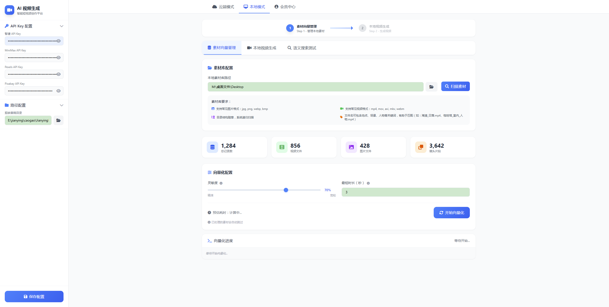
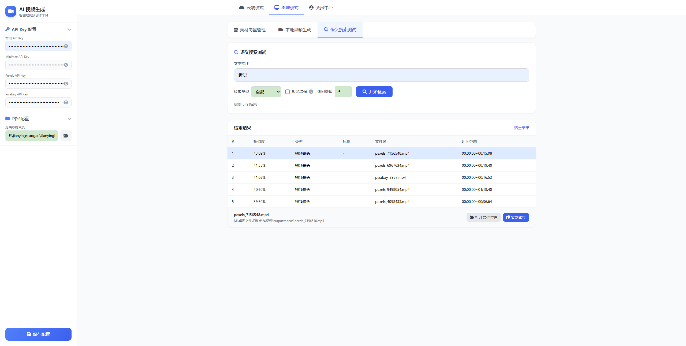
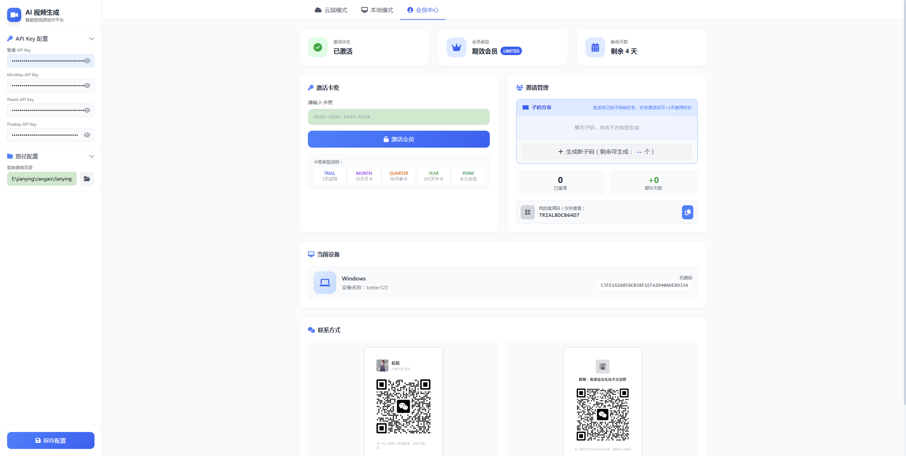

# AI 视频生成系统

输入一段口播文案，自动生成带配音、字幕、画面、背景音乐的完整短视频剪映草稿。

## 功能特性

- **AI 智能分析**：智谱 AI 提取关键词、分析场景类型和情绪风格
- **双源素材搜索**：支持 Pexels + Pixabay 视频素材搜索
- **智能配音**：30+ 种音色可选，支持语速调节
- **智能字幕**：自动生成 SRT 字幕文件
- **剪映草稿**：一键创建剪映项目，直接在剪映中编辑
- **双模式支持**：
  - 云端模式：在线搜索素材，无需预处理
  - 本地模式：CLIP 语义匹配自有素材库

## 环境要求

- Python 3.10+
- 剪映桌面版 **5.9+** 版本（用于打开生成的草稿）
- API Keys（见下文）

## 安装

### 1. 克隆项目

```bash
git clone <项目地址>
cd auto-video-maker
```

### 2. 安装依赖

```bash
pip install -r requirements.txt
```

### 3. 配置 API Key

复制 `user_config.json` 为新文件，填入你的 API Keys：

```json
{
  "zhipu_key": "你的智谱AI Key",
  "modelverse_key": "你的MiniMax API Key",
  "pexels_key": "你的Pexels API Key",
  "pixabay_key": "你的Pixabay API Key",
  "drafts_root": "你的剪映草稿目录"
}
```

### 4. 获取 CLIP 模型（仅本地模式需要）

本地模式需要下载 CLIP 模型（约 718MB）：

[下载 CLIP 模型](https://bzggd.oss-cn-beijing.aliyuncs.com/model/clip_cn_vit-b-16.pt)

下载后放入 `auto_video/` 目录。

## 使用方式

### 方式一：Web 界面（推荐）

```bash
python server.py
```

然后访问 `http://localhost:8000/`

### 方式二：命令行

```bash
python main.py --script "你的视频文案"
```

## 界面预览

### 云端模式



### 本地模式 - 素材处理



### 本地模式 - 语义搜索测试



### 会员中心



### 交流群


## API Keys 申请

| API | 用途 | 申请地址 |
|-----|------|----------|
| 智谱 AI | AI 文案分析、BGM/音效推荐 | https://open.bigmodel.cn/ |
| MiniMax | TTS 语音配音 | https://www.minimax.io/ |
| Pexels | 视频素材搜索 | https://www.pexels.com/api/ |
| Pixabay | 视频素材搜索（备选） | https://pixabay.com/api/ |

## 项目结构

```
auto-video-maker/
├── auto_video/           # 核心模块
│   ├── ai_analyzer.py    # AI 文案分析
│   ├── video_searcher.py # 视频素材搜索
│   ├── tts_generator.py   # 配音生成
│   ├── subtitle_generator.py # 字幕生成
│   ├── jianying_maker.py  # 剪映草稿制作
│   └── local_clip_matcher.py # 本地 CLIP 匹配
├── skills/
│   └── jianying-editor/  # 剪映 skill（核心依赖）
├── server.py             # Web 服务入口
├── main.py               # 命令行入口
├── smart_video.py        # 智能视频入口
├── config.py             # 配置文件
└── index.html            # Web 界面
```

## 授权激活

本项目需要激活后才能使用。

### 激活方式

1. 进入「会员中心」页面
2. 输入下方任意一个试用码
3. 点击激活

### 试用码（每个可用 5 天）

```
TRIALAA1E0388
TRIAL6EBBFB7E
TRIAL1CC33F05
TRIAL0C0D7C7D
TRIALC2D08129
TRIAL4E34FA7F
TRIAL9A0C59AF
TRIAL0DEFDCAA
TRIAL54556538
TRIAL105E8A3E
TRIAL7418AD69
TRIALC4CB8DB8
TRIAL51BE3B77
TRIALC7A198E9
TRIALB1867C03
TRIALEAAFEA48
TRIALC5D11779
TRIAL4D6CDCA1
TRIAL0C473902
TRIAL4C38D5E4
TRIAL3B3CC460
TRIAL2C9F1C70
TRIALF507F99C
TRIALE18CE548
TRIAL80B1EE01
TRIALA46D33A4
TRIAL617A8AF7
TRIALD9065DDB
TRIAL2AFE15CF
TRIAL381E941C
TRIALDB239F47
TRIAL0F92F9E0
TRIAL06A882A8
TRIALEF346A56
TRIAL04842A40
TRIAL61515E84
TRIALED8E1CAB
TRIALD1BB3E45
```

> 注意：试用码为共享资源，如果无法激活可能已被使用完。可联系作者获取更多试用码。

## License

MIT License
